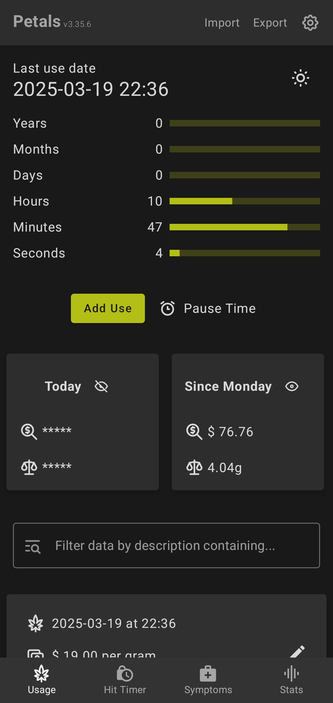
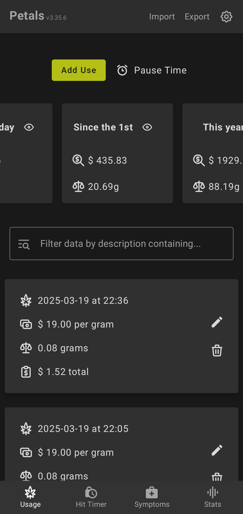

# Petals

[)](https://github.com/LeoColman/Petals/releases)
[)](https://github.com/LeoColman/Petals/releases/latest)

    

------
The Open Source app Petals aims to help its users to either quit weed, reduce usage or simply know how much they're
using.

### ⚠️ The Google Play Store version contains advertisements

For an ad free experience download the app from other release channels.

## 🌐 Contributing Translations

Petals welcomes community contributions for translations! To contribute translations, please follow these guidelines:

- ✨ **New Languages**: If you are adding a new language, translations must be 100% complete before submission.
- ⚠️ **Minimum Completion**: Translations that fall below 60% completion will be removed to maintain quality.
- 🤝 **Contribution Methods**:
  - 🌍 Non-programmers are encouraged to collaborate via [Weblate](https://hosted.weblate.org/engage/petals-app/).
  - 🖥️ Programmers may contribute translations via pull requests directly on GitHub.

Translations are hosted at Weblate. You can contribute to your language [here](https://hosted.weblate.org/engage/petals-app/).

## Screenshots

Open to see screenshots

[More Screenshots](fastlane/metadata/android/en-US/images/phoneScreenshots/)

## Building

You can assemble both debug and release versions of the app for different variants (F-Droid, Playstore, GitHub) using
the corresponding Gradle tasks. Here's how to do that:

### Debug Version

- F-Droid: `./gradlew assembleFdroidDebug`
- PlayStore: `./gradlew assemblePlaystoreDebug`
- GitHub: `./gradlew assembleGithubDebug`

### Release Version

For the release version, you must first decrypt secrets using `git secret reveal`. The release version can be assembled
as follows:

- F-Droid: `./gradlew assembleFdroidRelease`
- PlayStore: `./gradlew assemblePlaystoreRelease`
- GitHub: `./gradlew assembleGithubRelease`

## Git Secrets

The **Keystore**, **Keystore Properties**, and **Google Play deploy json** files are included in the repository using
[git secret](https://sobolevn.me/git-secret/). The current secret owners are:

- Leonardo Colman Lopes
    - Fingerprint `B3A5 9909 9ECC 4DB4 FD40 896F 7706 1922 C587 2792`
    - Original Author

- GitHub Actions
    - Fingerprint `882E 409C 71F4 565B 1698 B947 A992 5FF4 75B3 5E07`
    - Auto-publishing signed app to GitHub
    - Expires on 2027-04-05
    - Available on environment secret `GPG_KEY`

## Releasing

Release to all our channels is made automatically after a tag is released. The workflow responsible for doing this
is [release.main.kts](.github/workflows/release.main.kts).

### Google Play Store

1. Decrypt all git secrets
2. Run `./gradlew bundlePlaystoreRelease`
3. Publish to playstore by running
   `cd fastlane && bundle config path vendor/bundle && bundle install --jobs 4 --retry 3 && bundle exec fastlane playstore`

### F-Droid

F-Droid builds automatically from the repository whenever a new tag is published. The definitions for how to build the
app are
in [F-Droid's data repository](https://gitlab.com/fdroid/fdroiddata/-/blob/master/metadata/br.com.colman.petals.yml). If
modifications are required, the place to change is there.

### Releases Page

1. Decrypt all git secrets
2. Run `./gradlew assembleGithubRelease`
